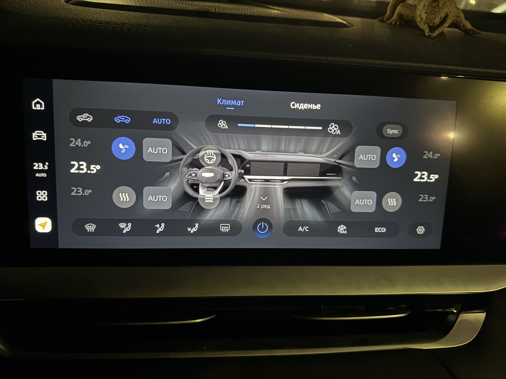
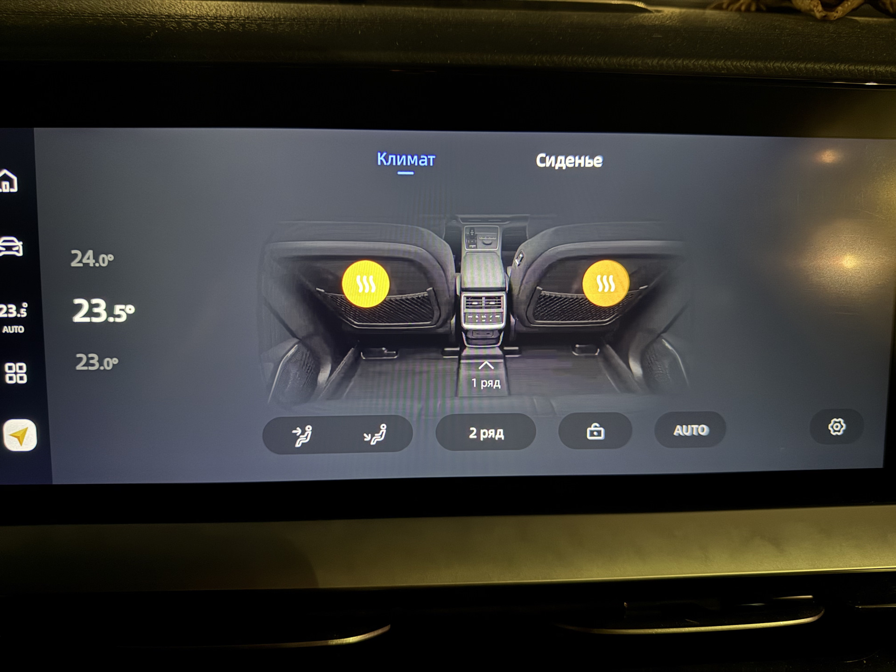
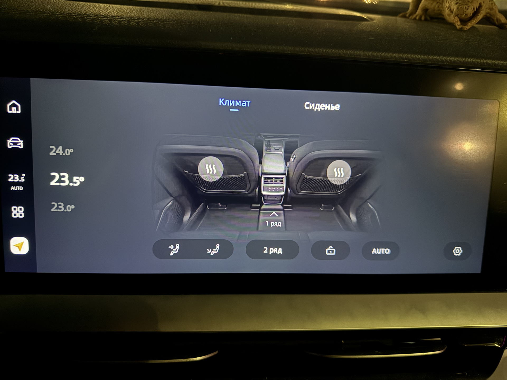

# oneOS_Hvac — расширение климата для Geely Monjaro REST 1

[](https://github.com/Schum-io/Geely_Monjaro_oneOS_Hvac/releases)
[](https://github.com/Schum-io/Geely_Monjaro_oneOS_Hvac/releases)
[](https://github.com/Schum-io/Geely_Monjaro_oneOS_Hvac/releases)

Magisk-модуль, расширяющий стандартное приложение климата (HVAC) головного устройства **Geely Monjaro REST 1**.

За основу взят APK из прошивки **GMC** (Geely Mod Custom).

Добавляет на главный экран климата управление обогревом, вентиляцией и массажем сидений — функции, которые в оригинальном приложении спрятаны в дополнительном меню.

---

## Скриншоты результата

### Передний ряд (1 ряд)

| Все функции активны | Обогрев сидений включён | Вентиляция сидений включена |
|---|---|---|
|  |  |  |

### Задний ряд (2 ряд)

| Обогрев включён | Обогрев выключен |
|---|---|
|  |  |

---

## Изменённые файлы

### Layout

| Файл | Описание |
|------|----------|
| `app/src/main/res/layout/pager_item_aircondition.xml` | Главный экран климата — добавлены новые элементы управления |

### Smali (декомпилированный байткод)

Все файлы находятся в пакете `com/geely/hvac/adapter/`:

| Класс | Описание |
|-------|----------|
| `AirConditionViewHolder$AcPanelController` | Основной контроллер панели климата |
| `AirConditionViewHolder$AcPanelController$ContainerRunnable` | Управление контейнером панели |
| `AirConditionViewHolder$AcPanelController$Row1LeftHeatRunnable` | Обогрев, левая сторона (ряд 1) |
| `AirConditionViewHolder$AcPanelController$Row1LeftWindRunnable` | Вентиляция, левая сторона (ряд 1) |
| `AirConditionViewHolder$AcPanelController$Row1RightHeatRunnable` | Обогрев, правая сторона (ряд 1) |
| `AirConditionViewHolder$AcPanelController$Row1RightWindRunnable` | Вентиляция, правая сторона (ряд 1) |
| `AirConditionViewHolder$AcPanelController$Row1SteeringWheelHeatRunnable` | Обогрев руля (ряд 1) |
| `AirConditionViewHolder$AcPanelController$Row2LeftRunnable` | Управление, левая сторона (ряд 2) |
| `AirConditionViewHolder$AcPanelController$Row2RightRunnable` | Управление, правая сторона (ряд 2) |

---

## Работа с APK через apktool

### Распаковка APK

Распаковать оригинальный APK в рабочий каталог:
```bash
apktool d oneOS_Hvac.apk -o apktool_workspace/modified/oneOS_Hvac
```

После этого в `apktool_workspace/modified/oneOS_Hvac/` появятся ресурсы и smali-код.
**Сборка APK происходит из этого каталога.**

### Редактирование layout файлов

Layout файлы редактируются в каталоге `app/src/main/res/layout/` — здесь используется Android Data Binding.

После внесения изменений скрипт сборки (`build_magisk_module.sh`) **автоматически** копирует их в `apktool_workspace/modified/oneOS_Hvac/res/layout/` с удалением Data Binding-разметки, несовместимой с apktool.

Для ручного копирования:
```bash
cp app/src/main/res/layout/pager_item_aircondition.xml \
   apktool_workspace/modified/oneOS_Hvac/res/layout/
```

### Сборка APK

```bash
apktool b apktool_workspace/modified/oneOS_Hvac -o magisk/system/app/oneOS_Hvac/oneOS_Hvac.apk
```

### Подпись APK

1. **Создание keystore** (только при первом использовании):
    ```bash
    keytool -genkey -v -keystore oneOS_Hvac.keystore \
        -alias oneOS_Hvac -keyalg RSA -keysize 2048 -validity 10000
    ```

2. **Настройка `.env` файла** в корне проекта:
    ```
    KEYSTORE_PASSWORD=ваш_пароль
    ```

3. **Подпись APK**:
    ```bash
    jarsigner -verbose -sigalg SHA1withRSA -digestalg SHA1 \
        -keystore oneOS_Hvac.keystore \
        -storepass "$KEYSTORE_PASSWORD" \
        magisk/system/app/oneOS_Hvac/oneOS_Hvac.apk oneOS_Hvac
    ```

---

## Автоматическая сборка модуля Magisk

```bash
./build_magisk_module.sh
```

Скрипт выполняет весь цикл автоматически:

1. Копирует изменённые layout файлы из `app/src/main/res/layout/` в `apktool_workspace/modified/oneOS_Hvac/res/layout/` (с удалением Data Binding)
2. Собирает APK: `apktool b apktool_workspace/modified/oneOS_Hvac`
3. Подписывает APK (пароль берётся из `.env`)
4. Создаёт архив модуля: `./build/oneOS_Hvac.zip`

> **Требования:** файл `.env` с переменной `KEYSTORE_PASSWORD` должен существовать до запуска скрипта.

### Установка модуля

Готовый модуль `./build/oneOS_Hvac.zip` устанавливается через **Magisk Manager** на устройстве:
`Magisk → Modules → Установить из хранилища → oneOS_Hvac.zip`

---

## Просмотр логов

На головном устройстве открыть терминал и выполнить:
```bash
su
logcat -f /storage/sdcard/crash_log.txt
```
